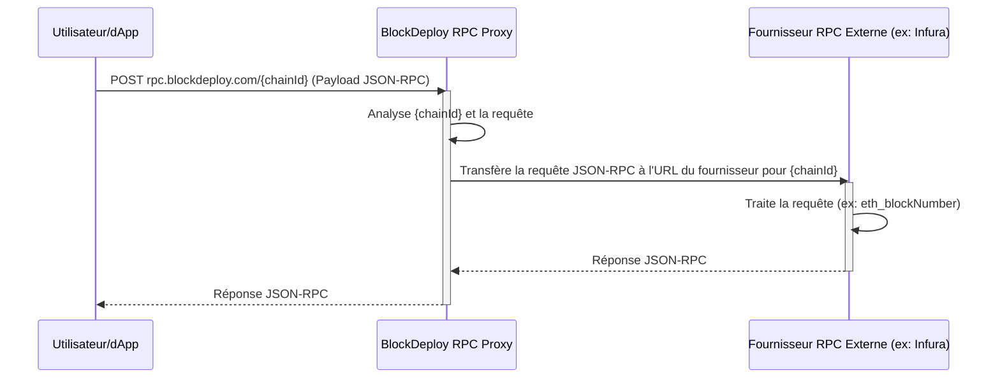
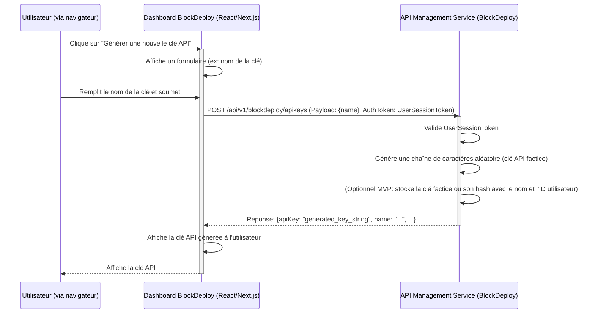
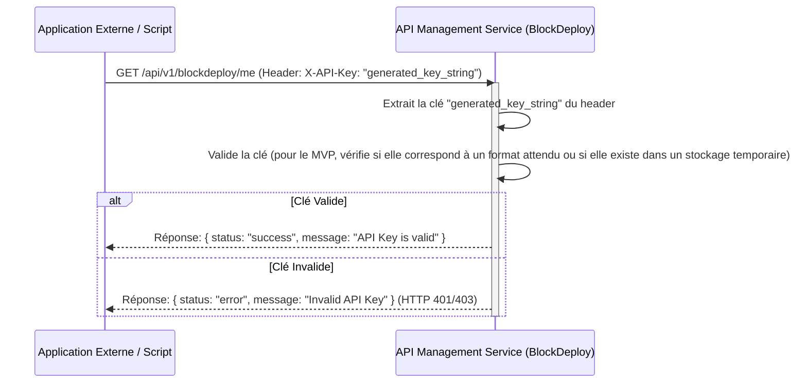

```markdown
# Diagrammes et Séquences - Module RPC & API Generator

**Document élaboré par : Team Primex Software**
**Site Web : https://primex-software.com**
**Version : 1.0**

---
**Signé : Team Primex Software – https://primex-software.com**
---

## Table des Matières

1.  [Introduction](#1-introduction)
2.  [Séquence : Requête RPC via le Proxy (MVP)](#2-séquence--requête-rpc-via-le-proxy-mvp)
3.  [Séquence : Génération de Clé API BlockDeploy (MVP)](#3-séquence--génération-de-clé-api-blockdeploy-mvp)
4.  [Séquence : Utilisation d'une Clé API BlockDeploy pour un Service Mock (MVP)](#4-séquence--utilisation-dune-clé-api-blockdeploy-pour-un-service-mock-mvp)
5.  [Architecture Logique du RPC Proxy (Futur - avec authentification)](#5-architecture-logique-du-rpc-proxy-futur---avec-authentification)

## 1. Introduction

Ce document fournit des diagrammes de séquence et des descriptions de flux pour illustrer le fonctionnement du module RPC & API Generator, en particulier pour les fonctionnalités du MVP.

## 2. Séquence : Requête RPC via le Proxy (MVP)

Ce diagramme illustre le flux d'une requête JSON-RPC standard passant par le proxy BlockDeploy pour atteindre un fournisseur RPC externe. Pour le MVP, aucune authentification spécifique de l'utilisateur n'est requise pour utiliser le proxy RPC.



**Description du Flux :**
1.  **Client (Utilisateur/dApp) :** Envoie une requête POST avec un payload JSON-RPC à l'endpoint du proxy BlockDeploy, en spécifiant le `chainId` dans l'URL (ex: `rpc.blockdeploy.com/5` pour Goerli).
2.  **BlockDeploy RPC Proxy :**
    *   Reçoit la requête.
    *   Identifie le `chainId` cible.
    *   Consulte sa configuration interne pour trouver l'URL du fournisseur RPC externe (ex: Infura, Alchemy) correspondant à ce `chainId`.
    *   Relaye la requête JSON-RPC originale au fournisseur externe.
3.  **Fournisseur RPC Externe :**
    *   Reçoit la requête.
    *   Interagit avec le nœud blockchain correspondant.
    *   Retourne la réponse JSON-RPC au proxy BlockDeploy.
4.  **BlockDeploy RPC Proxy :**
    *   Reçoit la réponse du fournisseur externe.
    *   Relaye cette réponse JSON-RPC au client original.
5.  **Client :** Reçoit la réponse JSON-RPC.

## 3. Séquence : Génération de Clé API BlockDeploy (MVP)

Ce diagramme illustre comment un utilisateur authentifié sur la plateforme BlockDeploy génère une clé API (factice pour le MVP).


**Description du Flux :**
1.  **Utilisateur :** Interagit avec le Dashboard BlockDeploy pour demander la création d'une clé API.
2.  **Frontend Dashboard :**
    *   Envoie une requête `POST` au backend (`API Management Service`) avec le nom souhaité pour la clé. Cette requête est authentifiée (l'utilisateur est déjà connecté à BlockDeploy).
3.  **API Management Service (Backend) :**
    *   Vérifie l'authentification de l'utilisateur.
    *   Génère une clé API (pour le MVP, une simple chaîne aléatoire suffit).
    *   Optionnellement, stocke cette clé ou une référence (même factice) associée à l'utilisateur.
    *   Retourne la clé générée au frontend.
4.  **Frontend Dashboard :** Affiche la clé API à l'utilisateur (avec un avertissement de la copier car elle ne sera peut-être pas montrée à nouveau).

## 4. Séquence : Utilisation d'une Clé API BlockDeploy pour un Service Mock (MVP)

Ce diagramme montre comment une clé API BlockDeploy (générée précédemment) est utilisée pour s'authentifier auprès d'un endpoint de test (mock).


**Description du Flux :**
1.  **Application Externe / Script :** Envoie une requête à un endpoint protégé de BlockDeploy (ex: `/api/v1/blockdeploy/me`). La requête inclut la clé API BlockDeploy dans un header (ex: `X-API-Key` ou `Authorization: Bearer`).
2.  **API Management Service (Backend) :**
    *   Reçoit la requête et extrait la clé API du header.
    *   Valide la clé. Pour le MVP, cette validation peut être très simple (ex: vérifier qu'elle n'est pas vide, ou qu'elle correspond à une clé factice précédemment "générée"). Dans une version future, cela impliquerait une recherche en base de données et la vérification des permissions associées.
    *   Retourne une réponse appropriée indiquant si la clé est valide ou non.

## 5. Architecture Logique du RPC Proxy (Futur - avec authentification)

Ceci est une vue plus avancée, non pour le MVP, mais pour montrer la direction.

```
+---------------------+      +--------------------------+      +-----------------------+
| Client (dApp/User)  |----->| BlockDeploy RPC Proxy    |----->| Auth Service (Internal)|
+---------------------+      | (Node.js/Go)             |      +-----------------------+
                             |                          |                 |
                             | 1. Reçoit requête RPC     |                 | 3. Valide API Key
                             | 2. Extrait API Key (User)|                 |    et permissions
                             |    (Header/Query Param)  |                 |
                             |                          | <---------------
                             | 4. Si valide:            |
                             |    - Rate Limiting       |
                             |    - Logging             |      +-----------------------+
                             |    - Routing basé sur    |----->| Chain Node Provider   |
                             |      ChainID & User Plan |      | (Infura, Alchemy,     |
                             |                          |      |  Self-Hosted Nodes)   |
                             +--------------------------+      +-----------------------+
                                         ^                                |
                                         |--------------------------------
                                                5. Réponse RPC
```

---
**Signé : Team Primex Software – https://primex-software.com**
```
