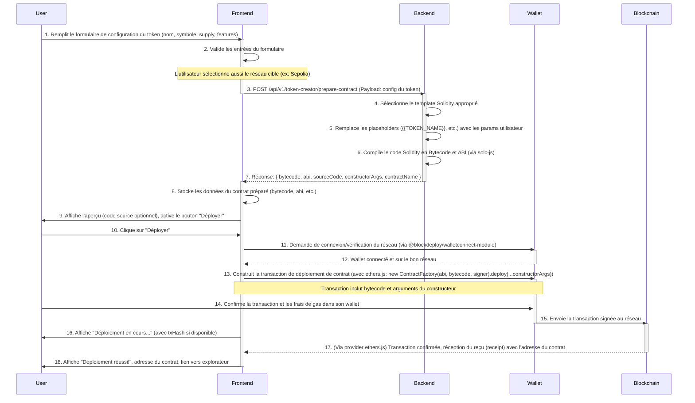

```markdown
# Flux de Compilation et Déploiement - Module : Token Creator

**Document élaboré par : Team Primex Software**
**Site Web : https://primex-software.com**
**Version : 1.0**

---
**Signé : Team Primex Software – https://primex-software.com**
---

## Table des Matières

1.  [Introduction](#1-introduction)
2.  [Acteurs Principaux](#2-acteurs-principaux)
3.  [Flux Détaillé](#3-flux-détaillé)
    *   [Phase 1 : Configuration Utilisateur (Frontend)](#phase-1--configuration-utilisateur-frontend)
    *   [Phase 2 : Préparation du Contrat (Frontend → Backend → Frontend)](#phase-2--préparation-du-contrat-frontend--backend--frontend)
    *   [Phase 3 : Déploiement sur la Blockchain (Frontend → Wallet → Blockchain)](#phase-3--déploiement-sur-la-blockchain-frontend--wallet--blockchain)
    *   [Phase 4 : Confirmation et Feedback (Blockchain → Frontend)](#phase-4--confirmation-et-feedback-blockchain--frontend)
4.  [Logique des Scripts Mock/Exemples](#4-logique-des-scripts-mockexemples)
    *   [4.1 `prepare-contract` (Logique Backend)](#41-prepare-contract-logique-backend)
    *   [4.2 `deploy-contract` (Logique Frontend)](#42-deploy-contract-logique-frontend)
5.  [Sécurité et Considérations](#5-sécurité-et-considérations)

## 1. Introduction

Ce document explique le pipeline complet, de la configuration du token par l'utilisateur jusqu'au déploiement effectif du smart contract sur la blockchain, pour le module Token Creator. Il détaille les interactions entre le frontend, le backend, et le wallet de l'utilisateur.

## 2. Acteurs Principaux

*   **Utilisateur :** Interagit avec l'interface frontend pour configurer et déployer son token.
*   **Frontend (BlockDeploy Token Creator UI) :** Interface React/Next.js qui collecte les informations, communique avec le backend, et interagit avec le wallet de l'utilisateur.
*   **Backend (BlockDeploy Token Creator API) :** Service qui génère le code Solidity, le compile en bytecode et ABI.
*   **Wallet Utilisateur :** Application (ex: MetaMask, Trust Wallet via WalletConnect) qui détient les clés privées de l'utilisateur et signe les transactions.
*   **Blockchain (Réseau EVM) :** Le réseau cible sur lequel le contrat de token sera déployé (ex: Sepolia testnet pour le MVP).

## 3. Flux Détaillé



### Phase 1 : Configuration Utilisateur (Frontend)

1.  **Utilisateur remplit le formulaire :** L'utilisateur interagit avec `TokenConfigurationForm` dans le frontend pour spécifier :
    *   Nom du token
    *   Symbole
    *   Supply initiale
    *   Décimales
    *   Fonctionnalités optionnelles (Mintable, Burnable)
    *   Son adresse (récupérée du wallet connecté, sera le `ownerAddress`)
2.  **Validation Frontend :** Le frontend effectue des validations de base sur les entrées (champs requis, formats).
3.  **Sélection du Réseau :** L'utilisateur choisit le réseau de déploiement via `NetworkSelector`.

### Phase 2 : Préparation du Contrat (Frontend → Backend → Frontend)

4.  **Appel API `/prepare-contract` :** Lorsque l'utilisateur clique sur "Préparer le Déploiement", le frontend envoie une requête `POST` au backend avec la configuration du token.
5.  **Génération du Code (Backend) :** Le backend :
    *   Sélectionne le template Solidity adéquat (ex: `ERC20_Mintable_Burnable.sol.template`).
    *   Injecte les paramètres de l'utilisateur dans les placeholders du template (ex: `{{TOKEN_NAME}}`, `{{INITIAL_SUPPLY}}`, conditions pour `IS_MINTABLE`, `IS_BURNABLE`).
6.  **Compilation (Backend) :** Le backend utilise `solc-js` pour compiler le code Solidity généré.
7.  **Réponse du Backend :** Le backend retourne au frontend :
    *   `sourceCode` : Le code Solidity final généré.
    *   `bytecode` : Le bytecode du contrat compilé.
    *   `abi` : L'ABI (Application Binary Interface) du contrat.
    *   `constructorArgs` : Un objet contenant les arguments nécessaires pour le constructeur du contrat, formatés correctement (ex: la supply initiale ajustée avec les décimales).
    *   `contractName` : Le nom du contrat principal.
8.  **Stockage Frontend :** Le frontend stocke ces informations, prêtes pour le déploiement.
9.  **Feedback Utilisateur :** Le frontend peut afficher un aperçu du code source et active le bouton "Déployer".

### Phase 3 : Déploiement sur la Blockchain (Frontend → Wallet → Blockchain)

10. **Clic sur "Déployer" :** L'utilisateur initie le déploiement.
11. **Vérification Wallet/Réseau :** Le frontend (via `@blockdeploy/walletconnect-module`) s'assure que le wallet est connecté et sur le réseau sélectionné par l'utilisateur. Si le réseau du wallet est différent, l'utilisateur est invité à changer de réseau.
12. **Wallet Prêt.**
13. **Construction et Envoi de la Transaction :**
    *   Le frontend utilise une librairie Web3 (Ethers.js/Viem) et les informations du wallet connecté (le `signer`).
    *   Il instancie une `ContractFactory` avec l'ABI et le bytecode reçus du backend.
    *   Il appelle la méthode `deploy()` de la factory, en passant les `constructorArgs` (ex: `factory.deploy(args.tokenName, args.tokenSymbol, args.initialSupplyAdjusted, args.initialOwner)`).
    *   Ceci retourne une promesse qui se résout avec l'instance du contrat une fois déployé, mais d'abord, elle initie une demande de signature au wallet.
14. **Confirmation Utilisateur (Wallet) :** Le wallet de l'utilisateur affiche une demande de confirmation pour la transaction de création de contrat, incluant les frais de gas estimés. L'utilisateur doit approuver.
15. **Transaction Envoyée :** Une fois approuvée, le wallet signe la transaction et l'envoie au nœud RPC du réseau blockchain sélectionné.
16. **Feedback de Soumission :** Le frontend reçoit généralement un hash de transaction (`txHash`) dès que la transaction est soumise (avant confirmation). Il affiche un message "Déploiement en cours..."

### Phase 4 : Confirmation et Feedback (Blockchain → Frontend)

17. **Attente de Confirmation :** Le frontend attend la confirmation de la transaction. Avec Ethers.js, cela peut être fait avec `deployedContract.deployTransaction.wait()` ou `provider.waitForTransaction(txHash)`.
18. **Déploiement Réussi :** Une fois la transaction confirmée (incluse dans un bloc) :
    *   Le reçu de la transaction (`transactionReceipt`) est disponible, contenant l'adresse du contrat nouvellement créé (`contractAddress`).
    *   Le frontend affiche un message de succès, l'adresse du contrat, et un lien vers un explorateur de blocs pour visualiser le contrat et la transaction.

## 4. Logique des Scripts Mock/Exemples

Plutôt que des fichiers `.js` séparés à ce stade de documentation, la logique est décrite ici :

### 4.1 `prepare-contract` (Logique Backend)

Cette logique réside dans le handler de l'endpoint `POST /api/v1/token-creator/prepare-contract`.

```typescript
// Pseudo-code pour le handler backend (Node.js/Express)
async function handlePrepareContract(req, res) {
  try {
    const { tokenName, tokenSymbol, initialSupply, decimals, ownerAddress, features, license } = req.body;

    // 1. Validation des inputs (essentiel)
    if (!tokenName || !tokenSymbol /* ... autres validations ... */) {
      return res.status(400).json({ error: "Invalid parameters" });
    }

    // 2. Lire le template Solidity approprié
    // Pour le MVP, un seul template principal qui gère les options.
    const templatePath = path.join(__dirname, '../templates/ERC20_Base.sol.template');
    let templateContent = fs.readFileSync(templatePath, 'utf8');

    // 3. Remplacer les placeholders (utilisation d'un moteur de template comme Mustache ou simple replace)
    const contractSourceName = tokenName.replace(/\s+/g, ''); // Ex: "My Token" -> "MyToken"
    const dataForTemplate = {
      LICENSE: license || "MIT",
      TOKEN_NAME: tokenName,
      TOKEN_SYMBOL: tokenSymbol,
      TOKEN_CONTRACT_NAME: contractSourceName, // Nom du contrat Solidity
      INITIAL_SUPPLY: initialSupply, // Le constructeur Solidity gérera les décimales
      DECIMALS: decimals || 18,
      OWNER_ADDRESS: ownerAddress, // Utilisé pour le paramètre `initialOwner` du constructeur
      IS_MINTABLE: !!features?.isMintable,
      IS_BURNABLE: !!features?.isBurnable,
      // ... autres features ...
    };
    // Exemple avec Mustache: generatedSourceCode = Mustache.render(templateContent, dataForTemplate);
    // Ou avec des replaces simples et des blocs conditionnels manuels.
    // Pour les blocs conditionnels:
    if (dataForTemplate.IS_MINTABLE) {
        // Injecter le code relatif à mintable, les imports, etc.
    } else {
        // S'assurer que les sections mintable sont retirées
    }
    // Idem pour IS_BURNABLE

    const generatedSourceCode = applyTemplate(templateContent, dataForTemplate); // Fonction helper

    // 4. Compiler le code Solidity généré avec solc-js
    const compilerInput = { /* ... structure d'input pour solc ... */ language: 'Solidity', sources: { [contractSourceName + ".sol"]: { content: generatedSourceCode } }, settings: { optimizer: { enabled: true, runs: 200 }, outputSelection: { '*': { '*': ['abi', 'evm.bytecode.object'] } } } };
    const compiledOutput = JSON.parse(solc.compile(JSON.stringify(compilerInput)));

    // Gérer les erreurs/warnings de compilation
    if (compiledOutput.errors) { /* ... gestion ... */ }

    const contractArtifact = compiledOutput.contracts[contractSourceName + ".sol"][contractSourceName];
    const bytecode = "0x" + contractArtifact.evm.bytecode.object;
    const abi = contractArtifact.abi;

    // 5. Préparer les arguments du constructeur (ajuster la supply avec les décimales)
    const bigNumberInitialSupply = ethers.BigNumber.from(initialSupply);
    const bigNumberDecimals = ethers.BigNumber.from(dataForTemplate.DECIMALS);
    const adjustedInitialSupply = bigNumberInitialSupply.mul(ethers.BigNumber.from(10).pow(bigNumberDecimals));

    const constructorArgs = {
        tokenName: dataForTemplate.TOKEN_NAME,
        tokenSymbol: dataForTemplate.TOKEN_SYMBOL,
        initialSupply: adjustedInitialSupply.toString(), // En string pour les grands nombres
        initialOwner: dataForTemplate.OWNER_ADDRESS
    };

    res.status(200).json({
      message: "Contract prepared successfully.",
      data: { sourceCode: generatedSourceCode, bytecode, abi, constructorArgs, contractName: contractSourceName }
    });

  } catch (error) {
    console.error("Error in prepare-contract:", error);
    res.status(500).json({ error: "Internal Server Error", message: error.message });
  }
}

function applyTemplate(template, data) {
    let output = template;
    // Remplacer les placeholders simples
    output = output.replace(/{{LICENSE}}/g, data.LICENSE);
    output = output.replace(/{{TOKEN_NAME}}/g, data.TOKEN_NAME);
    output = output.replace(/{{TOKEN_SYMBOL}}/g, data.TOKEN_SYMBOL);
    output = output.replace(/{{TOKEN_CONTRACT_NAME}}/g, data.TOKEN_CONTRACT_NAME);
    // output = output.replace(/{{INITIAL_SUPPLY}}/g, data.INITIAL_SUPPLY); // Le constructeur s'en charge
    output = output.replace(/{{DECIMALS}}/g, data.DECIMALS.toString());
    // output = output.replace(/{{OWNER_ADDRESS}}/g, data.OWNER_ADDRESS); // Passé au constructeur

    // Gérer les blocs conditionnels pour les features
    if (data.IS_MINTABLE) {
        output = output.replace('{{#if IS_MINTABLE_IMPORT_OWNABLE}}', 'import "@openzeppelin/contracts/access/Ownable.sol";');
        output = output.replace('{{#if IS_MINTABLE_INHERIT_OWNABLE}}', ', Ownable'); // Assumant que Ownable n'est pas déjà là
        output = output.replace('{{#if IS_MINTABLE_CONSTRUCTOR_OWNABLE}}', `Ownable(${data.OWNER_ADDRESS})`);
        // Décommenter ou inclure la section de code pour mint()
        // Remplacer les commentaires de placeholder par le code réel
    } else {
        // Retirer les sections mintable ou les commenter
        // ex: output = output.replace(/{{#if IS_MINTABLE}}[\s\S]*?{{\/if}}/g, '');
    }
    // Idem pour IS_BURNABLE
    if (data.IS_BURNABLE) {
        output = output.replace('{{#if IS_BURNABLE_IMPORT}}', 'import "@openzeppelin/contracts/token/ERC20/extensions/ERC20Burnable.sol";');
        output = output.replace('{{#if IS_BURNABLE_INHERIT}}', ', ERC20Burnable');
    }
    // Nettoyer les placeholders conditionnels restants (ceux dont la condition était fausse)
    output = output.replace(/{{#if .*?}}[\s\S]*?{{\/if}}/g, ''); // Version simpliste
    output = output.replace(/{{#if .*?}}/g, '');
    output = output.replace(/{{\/if}}/g, '');


    return output;
}
```

### 4.2 `deploy-contract` (Logique Frontend)

Cette logique réside dans le composant frontend (`DeploymentPane` ou un service associé) qui gère le clic sur le bouton "Déployer".

```typescript
// Pseudo-code pour la fonction de déploiement côté client (React/Ethers.js)
// Supposons que `walletProvider` (venant de WalletConnect) et `signer` sont disponibles.
// `contractData` contient { abi, bytecode, constructorArgs } reçu du backend.

async function deployContract(walletProvider, contractData) {
  try {
    if (!walletProvider) throw new Error("Wallet not connected");

    const signer = walletProvider.getSigner(); // Obtenir le signataire
    const userAddress = await signer.getAddress();

    // Vérifier si l'adresse du signataire correspond à l'ownerAddress attendu (si nécessaire)
    // if(userAddress.toLowerCase() !== contractData.constructorArgs.initialOwner.toLowerCase()) {
    //   throw new Error("Mismatch between connected wallet address and intended owner address.");
    // }

    const factory = new ethers.ContractFactory(contractData.abi, contractData.bytecode, signer);

    // Les arguments du constructeur doivent être dans le bon ordre
    // L'objet constructorArgs du backend doit être mappé à un tableau ordonné
    const orderedConstructorArgs = [
        contractData.constructorArgs.tokenName,
        contractData.constructorArgs.tokenSymbol,
        ethers.BigNumber.from(contractData.constructorArgs.initialSupply), // S'assurer que c'est un BigNumber
        contractData.constructorArgs.initialOwner // Qui est normalement userAddress
    ];

    // Mettre à jour l'UI: "Déploiement en cours, veuillez confirmer dans votre wallet..."
    console.log("Deploying contract with args:", orderedConstructorArgs);

    const deployedContract = await factory.deploy(...orderedConstructorArgs);
    
    // Mettre à jour l'UI: "Transaction soumise: " + deployedContract.deployTransaction.hash
    // Attendre la confirmation
    const receipt = await deployedContract.deployTransaction.wait(); // Attendre 1 confirmation par défaut

    // Mettre à jour l'UI: "Déploiement réussi!"
    // "Adresse du contrat: " + receipt.contractAddress
    // "Hash de la transaction: " + receipt.transactionHash
    // "Lien vers l'explorateur: ..."

    return {
      contractAddress: receipt.contractAddress,
      transactionHash: receipt.transactionHash,
    };

  } catch (error) {
    console.error("Contract deployment failed:", error);
    // Mettre à jour l'UI avec le message d'erreur
    // Ex: si l'utilisateur rejette la transaction, ou si le gas est insuffisant.
    throw error; // Renvoyer l'erreur pour une gestion ultérieure
  }
}
```

## 5. Sécurité et Considérations

*   **Validation des Entrées :** Le backend doit valider rigoureusement tous les paramètres fournis par l'utilisateur pour éviter les injections ou les configurations invalides.
*   **Compilation Sécurisée :** Utiliser une version stable et auditée de `solc-js`. S'assurer que l'environnement de compilation est isolé si le code Solidity peut inclure des éléments plus complexes à l'avenir.
*   **Pas de Clés Privées au Backend :** Réitérer que le backend ne manipule jamais de clés privées. La signature et le paiement du gas sont entièrement gérés côté client par le wallet de l'utilisateur.
*   **Estimations de Gas :** Le backend peut fournir une estimation de gas, mais le wallet de l'utilisateur aura généralement une estimation plus précise au moment de la signature.
*   **Gestion des Erreurs :** Fournir un feedback clair à l'utilisateur à chaque étape, surtout en cas d'échec (transaction rejetée, fonds insuffisants, erreur réseau).
*   **Templates Solidity :** Les templates doivent être basés sur des contrats OpenZeppelin audités et bien compris. Toute modification doit être faite avec prudence.
*   **Idempotence de `/prepare-contract` :** L'appel à cet endpoint doit toujours retourner le même bytecode/ABI pour les mêmes inputs, il ne doit pas avoir d'effets de bord persistants sur le serveur.

---
**Signé : Team Primex Software – https://primex-software.com**
```
